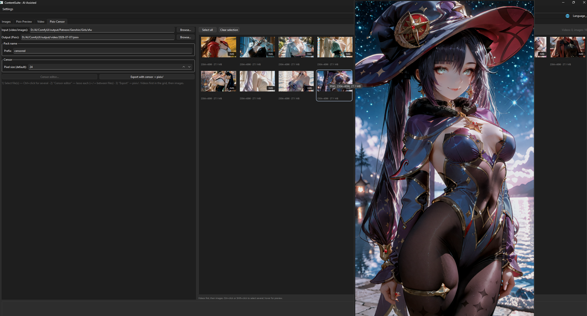
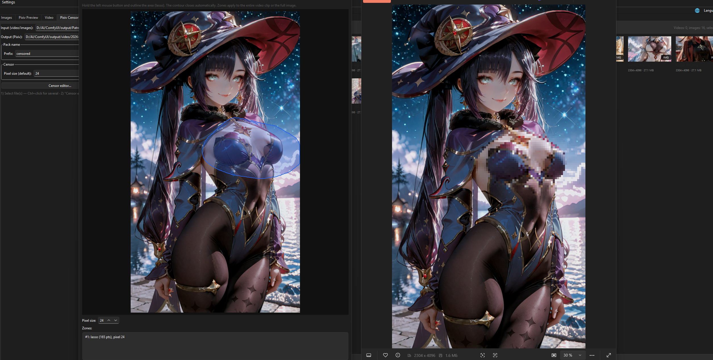
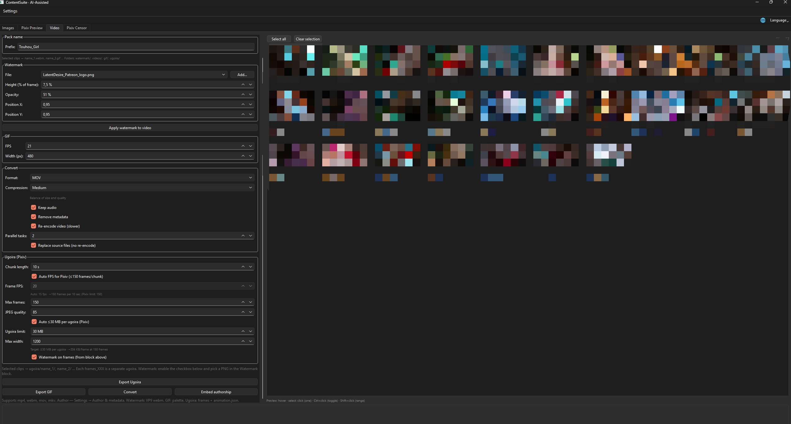

<div align="center">


# ContentSuite

[](LICENSE)

</div>

Desktop app for **Windows** and **Linux** that prepares images and video for **Patreon**, **Pixiv**, and **X**.

Free to download and use — **MIT-licensed**. Built for creators who publish on multiple platforms.

## Languages

The UI is fully translated — switch anytime from the **Language** menu in the toolbar:

- 🇬🇧 **English**
- 🇷🇺 **Русский**
- 🇯🇵 **日本語**

## Features

### Images
- Batch PNG/JPG → JPEG compression
- Metadata stripping (including ComfyUI / A1111 prompt chunks)
- Multi-page PDF export
- Grid selection for partial batches
- Sort tiles by **name** or **date (newest)** on the grid toolbar
- Optional original filenames on export

### Pixiv Preview
- Collage cover from 1–3 artworks on a white background
- Layout presets and frame styling

### Video
- Watermark overlay (position, opacity, size)
- Convert to mp4 / webm / mov
- **Compression presets** — dropdown from maximum to near-lossless (CRF x264 / VP9); saves space while keeping visual quality
- GIF export
- Ugoira export (frames + `animation.json`)
- Clip grid with hover preview and audio
- Metadata removal, audio on/off

### Pixiv Censor
- **Lasso** censorship on video and still images — hold LMB to outline an area; contour auto-closes
- One input folder for **video and images**; grid shows clips first, then artworks
- **Multi-file editor** — Ctrl+click to select several files, ←/→ to set zones on each
- Export to `pixiv/` as `name_1.mp4`, `name_2.jpg`, … (shared pack prefix)
- Adjustable mosaic pixel size (typical 12–24 for Pixiv)

### Art Checker
- Compare a **prompt-book JSON** (`arts` / `characters` / `prompts`) against a render output folder
- Tile grid with **OK / MISS** status, hover preview, copy art names (double-click copies the JSON **name**, not the file variant)
- **Duplicate renders** — stack badge when several files match one art (`name`, `name_2`, …); scroll the mouse wheel on hover to cycle variants
- Filter by status or section; sort by **name**, **date**, or **missing first**
- **Watch folder** — auto re-scan when files are added or removed outside the app
- Planned: dedicated **ComfyUI nodes** for reading and driving the same JSON workflow from graphs

### Media grids
Shared across **Images**, **Video**, **Pixiv Censor**, and **Art Checker**:
- **Selection styling** — selected tile: white background and dark filename; unselected: dark background and white filename (actual file name on the tile)
- Hover preview beside the grid (images, clips, censor media, art checker tiles)

Settings (folders, watermarks, image/video quality, compression level, author EXIF) are stored in:

| OS | Config path |
|----|-------------|
| Windows | `%APPDATA%\ContentSuite\config.json` |
| Linux | `~/.config/ContentSuite/config.json` (or `$XDG_CONFIG_HOME/ContentSuite/`) |

Logs and thumbnail caches live in the same folder.

## Screenshots

Optional visual walkthrough — SFW demo art only.

**Pixiv Censor** — media grid with hover preview. Mixed video and images in one folder; hover a tile to open a large preview beside the panel.



**Pixiv Censor** — lasso editor. Hold LMB to outline a zone; the contour auto-closes. Side-by-side original vs mosaic preview before export.



**Video** — settings and clip grid. Watermark, GIF, convert, compression presets, and ugoira options on the left; clip thumbnails with hover preview on the right.



**Art Checker** — prompt JSON vs output folder. Left: JSON path, scan folder, search; right: tile grid with OK/MISS badges, filter and sort on the grid toolbar.


## Requirements

- [Python](https://www.python.org/downloads/) 3.11+
- [ffmpeg](https://ffmpeg.org/) and `ffprobe` in `PATH`

**Windows:** 10/11 — primary platform, fully tested.

**Linux:** recent distro with Python 3.11+ and ffmpeg packages. Image processing, conversion, censor, and export work the same as on Windows. **Video hover preview** in the clip grid uses Qt Multimedia and may need extra packages (see below); ffmpeg-based export is unaffected.

## Quick start

### Windows — download (no Python)

Pre-built zip on **[GitHub Releases](https://github.com/LatentDesireAI/ContentSuite/releases)** — unzip and run `ContentSuite.exe`.

You still need [ffmpeg](https://ffmpeg.org/) in `PATH`. Settings go to `%APPDATA%\ContentSuite\`.

### Windows — from source

```bat
run.bat
```

`run.bat` creates a local `.venv`, installs dependencies, and launches the GUI.

Manual setup:

```bat
python -m venv .venv
.venv\Scripts\pip install -r requirements.txt
.venv\Scripts\pythonw main.py
```

### Linux

```bash
chmod +x run.sh   # once, after clone
./run.sh
```

Manual setup:

```bash
python3 -m venv .venv
source .venv/bin/activate
pip install -r requirements.txt
python main.py
```

**Optional — video hover preview** (if clips show a black tile or no audio on hover):

```bash
# Debian / Ubuntu
sudo apt install ffmpeg python3-venv gstreamer1.0-plugins-base gstreamer1.0-plugins-good gstreamer1.0-libav

# Fedora
sudo dnf install ffmpeg python3 gstreamer1-plugins-base gstreamer1-plugins-good
```

If preview still fails, use the grid for selection — all export jobs run through ffmpeg regardless.

## Project layout

```
main.py              — application entry point
tabs/                — UI tabs (images, video, pixiv preview, censor, art checker)
core/                — compression, censor, ffmpeg, watermark, art checker, config, PDF
ui/                  — grids, censor editor, dialogs, pickers
```

## Support & feedback

ContentSuite is free and MIT-licensed. If you stumbled on it, find it useful, and want to say thanks or support ongoing work, you can buy me a coffee on [Ko-fi](https://ko-fi.com/latentdesire).

I’m always open to ideas for improvements — feature requests, workflow tweaks, and bug reports are welcome (GitHub issues or any channel you already use to reach me).

## Authors

**[LatentDesireAI](https://github.com/LatentDesireAI)** — creator & maintainer

**AI-Assisted** — co-development with [Grok (xAI)](https://x.ai) via [Cursor](https://cursor.com)

## License

[MIT](LICENSE) — Copyright (c) 2026 LatentDesireAI